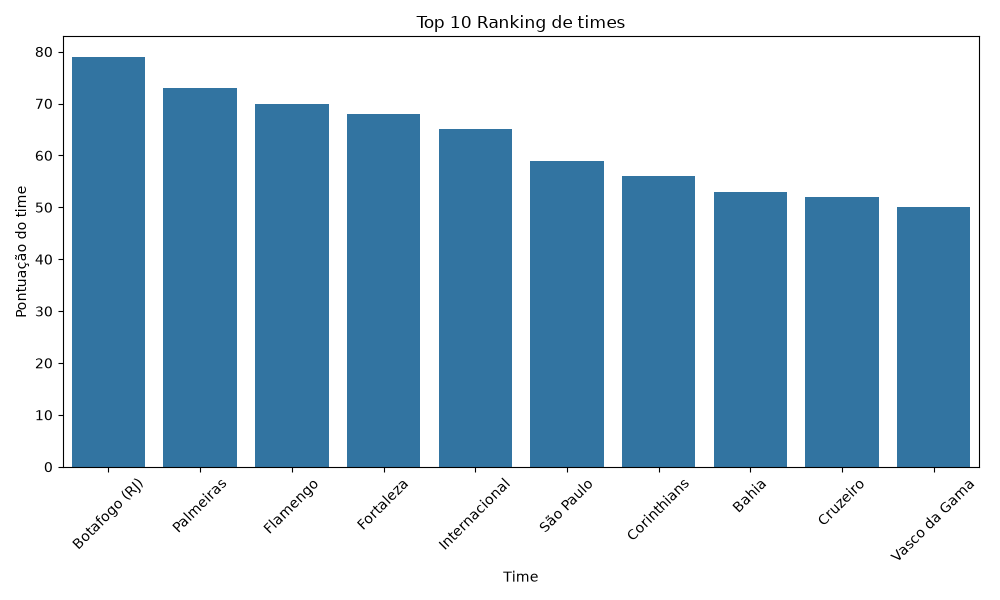
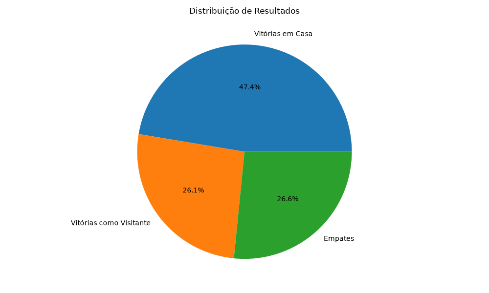
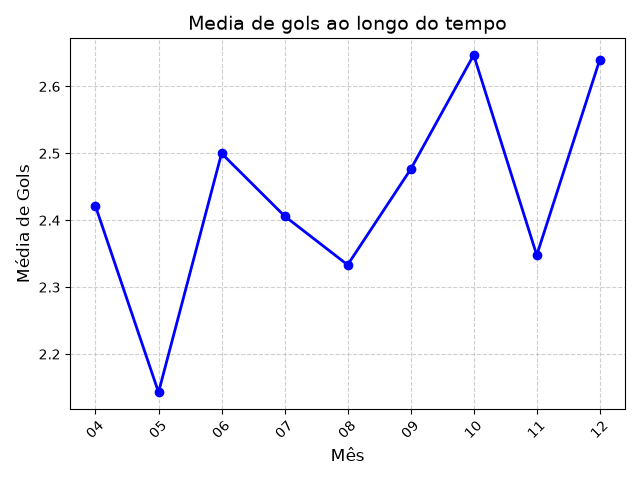

# ⚽ Análise de Dados do Campeonato Brasileiro Série A 2024

Projeto de análise exploratória de dados aplicado ao futebol brasileiro, utilizando **Python**, **SQL (SQLite)** e **visualização de dados** para extrair insights sobre a temporada 2024 do Brasileirão.

## 🎯 Objetivo

Analisar os 380 jogos da Série A 2024 para responder perguntas como:
- Qual foi a classificação final do campeonato?
- Jogar em casa realmente aumenta as chances de vitória?
- Como a média de gols variou ao longo da temporada?
- Existem fatores externos que impactaram o andamento do campeonato?

## 🗂️ Fonte dos dados

Dataset público do Kaggle: [Brasileirão 2024 (Série A)](https://www.kaggle.com/datasets/fabioschirmann/brasileiro-2024-srie-a-dataset), contendo data, horário, times, placar, público e estádio de todas as 380 partidas da temporada.

## 🛠️ Tecnologias utilizadas

- **Python** (pandas) — leitura, limpeza e transformação dos dados
- **SQLite** — armazenamento e consultas SQL
- **Matplotlib / Seaborn** — visualização de dados

## 🔧 Processo de tratamento dos dados (ETL)

Os dados brutos vieram com algumas inconsistências comuns em dados do mundo real, que precisaram ser tratadas:

- **Placar em coluna única** (ex: `1–1`) → separado em `gols_casa` e `gols_visitante`
- **Público como texto com separador de milhar** (ex: `"12,804"`) → convertido para número inteiro
- **Ausência de cabeçalho no CSV** → colunas nomeadas manualmente na leitura

Após o tratamento, o total de partidas carregadas foi validado em **380**, batendo com o número oficial de jogos da Série A 2024 (20 times, turno e returno).

## 📊 Principais insights

### 1. Classificação geral

O cálculo de pontos (3 por vitória, 1 por empate) foi feito somando o desempenho de cada time como mandante e como visitante. O resultado confirma a realidade: **Botafogo** terminou como campeão, com **79 pontos**, validando a consistência da análise.



### 2. O fator casa é real

Considerando as 380 partidas da temporada:

| Resultado | Percentual |
|---|---|
| Vitória do mandante | 47,4% |
| Vitória do visitante | 26,1% |
| Empate | 26,6% |

Jogar em casa quase **dobra** a chance de vitória em comparação a jogar fora — um dos padrões mais conhecidos do futebol, agora confirmado estatisticamente com dados da própria temporada.



### 3. Sazonalidade de gols — e o impacto das enchentes no RS

A média de gols por jogo variou ao longo da temporada, com um vale bem visível em **maio**:



Essa queda não foi coincidência: em maio de 2024, a CBF suspendeu o Brasileirão por 15 dias (rodadas 7 e 8, entre os dias 19 e 27) em razão das enchentes que atingiram o Rio Grande do Sul, reduzindo drasticamente o volume de jogos disputados naquele mês ([fonte: Agência Brasil](https://agenciabrasil.ebc.com.br/geral/noticia/2024-05/cbf-suspende-duas-rodadas-do-brasileirao-por-causa-de-cheias-no-rs)).

Esse ponto reforça a importância de sempre investigar o contexto por trás de uma anomalia nos dados, em vez de assumir que é apenas ruído estatístico.

### 4. Confrontos diretos

A base também permite consultar retrospectos entre times específicos — por exemplo, Flamengo x Palmeiras terminou com dois empates (0-0 e 1-1) na temporada, refletindo o equilíbrio comum entre grandes clubes.

## 📁 Estrutura do projeto

```
projeto-futebol/
├── main.py                          # Script principal (ETL + análises + gráficos)
├── Brasileiro 2024 (Série A) - Dataset - Final.csv   # Dados brutos
├── brasileiro_2024.db               # Banco SQLite gerado
├── graficos/                        # Imagens geradas
│   ├── ranking_times.png
│   ├── distribuicao_resultados.png
│   └── media_gols_por_mes.png
└── README.md
```

## ▶️ Como rodar o projeto

```bash
pip install pandas matplotlib seaborn
python main.py
```

## 🔮 Próximos passos

- Investigar se a queda de gols em maio se dá apenas pelo menor número de jogos ou também por mudança de padrão dos jogos remanejados
- Expandir a análise para múltiplas temporadas, permitindo comparação histórica do fator casa ao longo dos anos
- Adicionar dashboard interativo (Power BI ou Streamlit)

---

**Autor:** Nilton Cesar

Projeto desenvolvido como parte de estudos em Análise de Dados.

LinkedIn :www.linkedin.com/in/nilton-cesar-b728a4227
